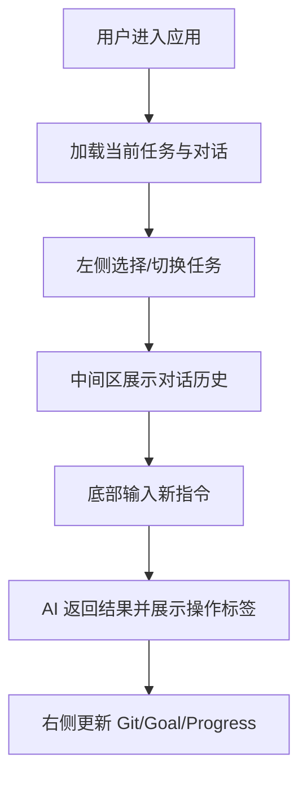

# AI 编码助手前端项目 — 产品需求文档 (PRD)

## 1. 产品概述
本项目是一个基于 Web 的 AI 编码助手界面，复刻参考项目 "web" 文件夹中的视觉设计规范与交互体验。采用深色主题、IDE 风格布局，提供任务管理、AI 对话、Git 工具集成的现代化工作台。
- 目标用户：开发者、AI 辅助编程用户
- 核心价值：提供沉浸式、高效率的 AI 协作编码环境

## 2. 核心功能

### 2.1 用户角色
| 角色 | 权限说明 |
|------|----------|
| 普通用户 | 浏览任务、与 AI 对话、查看 Git 状态 |

### 2.2 功能模块
1. **顶部标题栏（TitleBar）**
   - macOS 风格交通灯按钮（关闭/最小化/最大化）
   - 导航按钮（侧边栏切换、前进/后退）
   - 当前任务标题与仓库/分支信息
   - AI 模型切换与窗口控制操作

2. **左侧边栏（Sidebar）**
   - 顶部菜单：新建任务、打开工作区、技能
   - 任务列表：按项目分组展示任务，支持选中态、状态点、时间戳
   - 底部用户资料：头像、用户名、设置入口

3. **中间主内容区（Main Content）**
   - AI 对话流：支持多轮消息展示，含操作标签（搜索/运行/写入等）
   - 代码块与文件标签展示
   - 底部输入框：消息输入、快捷操作、模型选择、发送按钮

4. **右侧边栏（Rightbar）**
   - Git Tools：Changes 统计、分支信息、Commit 入口
   - Goal 面板：当前目标状态与进度
   - Progress 面板：任务完成清单

## 3. 核心流程
用户进入工作台 → 左侧浏览/切换任务 → 中间查看 AI 对话与操作记录 → 底部输入指令 → 右侧查看 Git/Goal/Progress 状态。

## 4. 用户界面设计

### 4.1 设计风格
- **主题风格**：深色 IDE 风格，高信息密度，专业开发者工具质感
- **主色调**：
  - 背景层级：#1a1d22 → #20242a → #262b32 → #2c323a
  - 文字层级：#d7dde5（主文字）→ #8a92a0（次级）→ #5f6773（弱化）
  - 强调色：#4a90ff（蓝色）→ #3ec78c（绿色成功）→ #ff6b6b（红色错误）→ #f5b740（黄色警告）
- **按钮样式**：扁平化、圆角 6px~12px、hover 时背景色变化
- **字体**：系统字体栈（-apple-system, BlinkMacSystemFont, PingFang SC, Microsoft YaHei, Segoe UI），等宽字体用于代码（JetBrains Mono, Fira Code）
- **布局**：三栏网格布局（240px + 1fr + 280px），顶部固定标题栏
- **图标**：emoji 风格与极简几何符号混用，Lucide 图标库补充

### 4.2 页面设计概览
| 页面/模块 | 子模块 | UI 元素说明 |
|-----------|--------|-------------|
| 标题栏 | 交通灯 | 12px 圆形，红黄绿三色 |
| 标题栏 | 导航按钮 | 28px 方形图标按钮，圆角 6px |
| 标题栏 | 标题区 | 文字截断省略、徽章标签、分支选择器 |
| 左侧栏 | 菜单 | 图标 + 文字 + 快捷键，hover/active 背景变化 |
| 左侧栏 | 任务列表 | 分组标题 + 任务项（状态点 + 文字 + 时间） |
| 左侧栏 | 用户资料 | 渐变头像 + 用户名 + 设置图标 |
| 主内容区 | 对话流 | 操作标签行（圆角标签、代码块、diff 统计） |
| 主内容区 | 对话流 | 正文段落，行高 1.7，#c8cfd8 |
| 主内容区 | 输入区 | 圆角卡片容器、透明输入框、底部工具栏 |
| 右侧栏 | Git Tools | 面板卡片，行布局，diff 增删数字标签 |
| 右侧栏 | Goal | 标题 + 状态胶囊 + 目标描述 + 元信息 |
| 右侧栏 | Progress | 勾选圆圈 + 任务描述列表 |

### 4.3 响应式适配策略
- **桌面优先**：默认三栏布局，最小适配宽度 1280px
- **平板适配（<1024px）**：隐藏右侧栏，主内容区自适应撑满
- **移动端（<768px）**：左侧栏变为可折叠抽屉，标题栏简化，输入区保持固定底部
- 所有滚动区域使用自定义滚动条（8px 宽度，#2e343c 滑块）

### 4.4 交互效果
- **Hover 状态**：菜单项/任务项/图标按钮背景色过渡至 #2c323a，颜色过渡至主文字色
- **发送按钮 Hover**：背景从 #3a3f48 过渡至 #4a90ff
- **状态点脉冲**：蓝色活跃状态点带 box-shadow 光晕效果
- **滚动条**：自定义 Webkit 滚动条，hover 时滑块颜色加深
- **过渡时长**：统一使用 150ms ease 或 200ms ease 的短促过渡，保持 IDE 工具的响应感
