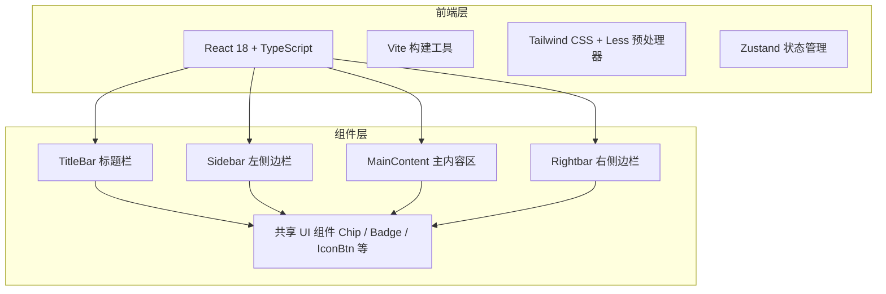

# AI 编码助手前端项目 — 技术架构文档

## 1. 架构设计



## 2. 技术描述
- **前端框架**：React 18 + TypeScript
- **构建工具**：Vite 5
- **样式方案**：Tailwind CSS 3 + Less 预处理器（变量与混合复用）
- **状态管理**：Zustand（轻量全局状态：当前任务、对话消息、侧边栏折叠状态）
- **路由**：react-router-dom（如需多页面扩展，当前单页应用可先预留）
- **图标**：lucide-react
- **代码高亮**：prism-react-renderer 或自建 code 样式（根据实现复杂度决定）

## 3. 路由定义
| 路由 | 用途 |
|------|------|
| / | 主工作台（当前唯一页面） |

## 4. 项目目录结构

```
├── src/
│   ├── components/          # 通用组件
│   │   ├── IconButton.tsx
│   │   ├── Badge.tsx
│   │   ├── Chip.tsx
│   │   ├── ActionTag.tsx
│   │   ├── StatusDot.tsx
│   │   └── Panel.tsx
│   ├── pages/
│   │   └── Workbench.tsx    # 主工作台页面
│   ├── sections/            # 页面级大区块
│   │   ├── TitleBar/
│   │   │   ├── TitleBar.tsx
│   │   │   └── TitleBar.less
│   │   ├── Sidebar/
│   │   │   ├── Sidebar.tsx
│   │   │   ├── TaskGroup.tsx
│   │   │   └── Sidebar.less
│   │   ├── MainContent/
│   │   │   ├── MainContent.tsx
│   │   │   ├── Conversation.tsx
│   │   │   ├── Composer.tsx
│   │   │   └── MainContent.less
│   │   └── Rightbar/
│   │       ├── Rightbar.tsx
│   │       ├── GitPanel.tsx
│   │       ├── GoalPanel.tsx
│   │       ├── ProgressPanel.tsx
│   │       └── Rightbar.less
│   ├── styles/
│   │   ├── variables.less   # 全局 CSS 变量（映射参考项目色系）
│   │   ├── global.less      # 全局基础样式（滚动条、code 样式等）
│   │   └── index.less       # 样式入口
│   ├── store/
│   │   └── useAppStore.ts   # Zustand 全局状态
│   ├── types/
│   │   └── index.ts         # TypeScript 类型定义
│   ├── App.tsx
│   ├── App.less
│   └── main.tsx
├── index.html
├── vite.config.ts
├── tailwind.config.js
├── postcss.config.js
├── tsconfig.json
└── package.json
```

## 5. 关键技术决策

1. **Less + Tailwind 混用**
   - Less 负责全局 CSS 变量、复杂嵌套选择器、滚动条等自定义样式
   - Tailwind 负责快速原子类布局、间距、flex/grid、响应式工具类
   - 两者通过 `postcss` 和 `less` 插件并行处理

2. **CSS 变量映射参考项目**
   - 在 `variables.less` 中完整映射参考项目的 `:root` 变量，确保视觉一致性
   - Tailwind 配置中通过 `theme.extend.colors` 引入这些变量

3. **组件拆分原则**
   - 每个组件文件不超过 300 行
   - 页面级区块放入 `sections/`，通用小组件放入 `components/`
   - 样式与组件就近维护（同目录 `.less` 文件）

4. **响应式断点**
   - 桌面：`grid-cols-[240px_1fr_280px]`
   - 平板（<1024px）：隐藏 rightbar，`grid-cols-[240px_1fr]`
   - 移动端（<768px）：sidebar 变为抽屉，`grid-cols-1`
